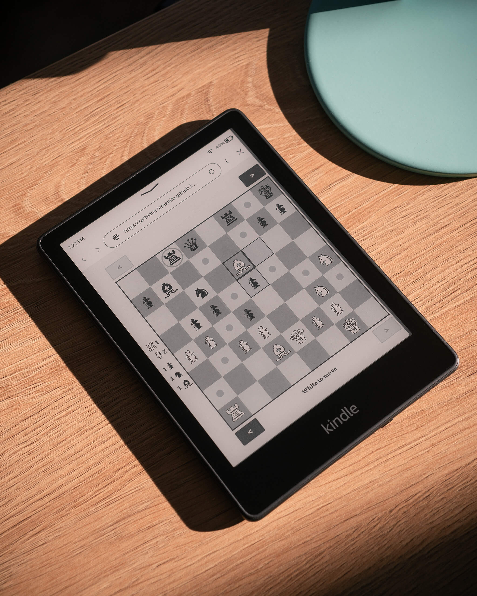

# Chess for Kindle

A simple chess game for **two people on one Kindle**.

For quiet evenings at home, slow mornings in a cafe, park, or long trips where you just want something simple and real.
No accounts. No AI. No distractions.  
Just chess.

  

## Why this exists

eReader screens feel close to paper.  
This project turns your Kindle into a minimal, paper-like chessboard you can share with another person.

Just sit opposite each other and play.

## Features

- **Made for E-Ink:** High contrast, no animations, no flicker.
- **Two humans, one device:** The board rotates automatically for face-to-face play.
- **Lightweight:** Loads fast, drains almost no battery.

## How to Play

1. Open https://artemartemenko.github.io/chess-for-kindle/ or https://is.gd/chesskindle in the Kindle Web Browser.
2. Sit opposite each other.
3. Make the first move.

Settings: Double-tap empty square to **lock** piece rotation.

Tip: Bookmark the game page so you don't lose it. If you don't open other websites, the game will even launch automatically when you open your browser.

You can support ongoing development of this project:

  

## Compatibility

Should work on most Kindles and other devices with a browser and a touchscreen.

Tested on:
- **Kindle 10 (10th Gen)**
- **Kindle Paperwhite 4 (10th Gen)**
- **Kindle Paperwhite 5 (11th Gen)**
- **iPad Pro 13-inch (M4)**

## Changelog

### Version 1.1
* Redesigned the interface: updated chess pieces, the board now occupies more screen space, plus various minor improvements.
* Game state now persists after page reload.

**Bug fixes**
* Fixed draw detection logic for threefold repetition.

### Version 1.0
* Initial release.

## License

MIT — free to use, modify, and share.
