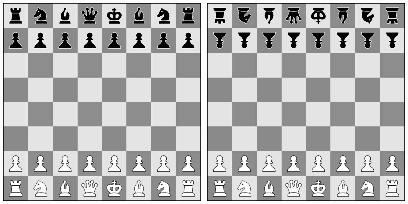

# Chess for Kindle

A simple chess game for **two people on one Kindle**. Turn your eReader into a minimal, paper-like chessboard you can share with another person. For quiet evenings at home, slow mornings in a cafe, a park, or long trips where you just want something simple and real.

No accounts. No AI. No distractions. Just chess.

  

## Features

- **Made for E-Ink:** High contrast, no animations, no flicker.
- **Lightweight:** Loads fast, drains almost no battery.
- **Offline mode**: The game works without an internet connection! However, it’s recommended to connect occasionally and refresh the page to get the latest updates.
- **Game persistence:** The chess game can be resumed after closing the browser or reloading the page.
- **Two humans, one device:** The board rotates automatically for face-to-face play, or use a double-tap on an empty square to keep your opponent’s pieces flipped.

  

## How to Play

1. Open https://artemartemenko.github.io/chess-for-kindle/ or https://is.gd/chesskindle in the Kindle Web Browser.
2. Sit opposite each other.
3. Make the first move.

Tip: Bookmark the game page so you don't lose it. If you don't open other websites, the game will even launch automatically when you open your browser.

You can support the further development of this and new projects for Kindle:

  

## Compatibility

Should work on most Kindles and other devices with a browser and a touchscreen.

<strong>Tested on</strong>

- **Kindle 10** (10th Gen)
- **Kindle Paperwhite 4** (10th Gen)
- **Kindle Paperwhite 5** (11th Gen)
- **iPad** (9th Gen)
- **iPad Pro** (2nd Gen)
- **iPad Pro** (7th Gen, M4, 13-inch)

