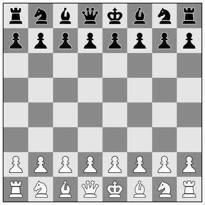
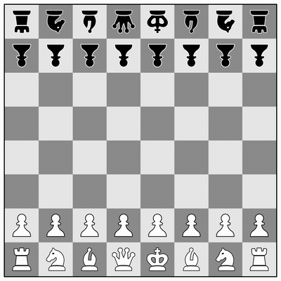

# Chess for Kindle

A simple chess game for **two people on one Kindle**.

For quiet evenings at home, slow mornings in a cafe, park, or long trips where you just want something simple and real.

No accounts. No AI. No distractions.  
Just chess.

  

## Why this exists

eReader screens feel close to paper.  
This project turns your Kindle into a minimal, paper-like chessboard you can share with another person.

Just sit opposite each other and play.

## Features

- **Made for E-Ink:** High contrast, no animations, no flicker.
- **Lightweight:** Loads fast, drains almost no battery.
- **Game persistence:** The chess game can be resumed after closing the browser or reloading the page.
- **Two humans, one device:** The board rotates automatically for face-to-face play, or use a double-tap on an empty square to keep your opponent’s pieces flipped.

  
     
    <small><i>Mode 1</i></small>
  
  
     
    <small><i>Mode 2</i></small>
  

## How to Play

1. Open https://artemartemenko.github.io/chess-for-kindle/ or https://is.gd/chesskindle in the Kindle Web Browser.
2. Sit opposite each other.
3. Make the first move.

Tip: Bookmark the game page so you don't lose it. If you don't open other websites, the game will even launch automatically when you open your browser.

## Offline mode

Offline mode is possible!
Kindle does not allow locally saved web pages to be opened, and without an internet connection you may get a connection error after reloading the game page.
However, there are two ways to **restore the chess page offline**:

* close the browser and open it again (does not always work)
* navigate to any other address (just add any character to the URL) and then return to the previous page using the Back button — the game will be restored from the cache.

At the same time, I am exploring the possibility of a more convenient solution for offline play.

You can support ongoing development of this project:

  

## Compatibility

Should work on most Kindles and other devices with a browser and a touchscreen.

<strong>Tested on</strong>

- **Kindle 10** (10th Gen)
- **Kindle Paperwhite 4** (10th Gen)
- **Kindle Paperwhite 5** (11th Gen)
- **iPad** (9th Gen)
- **iPad Pro** (2nd Gen)
- **iPad Pro** (7th Gen, M4, 13-inch)

## License

MIT — free to use, modify, and share.
